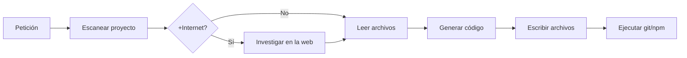

# Local Copilot — IA local para VS Code

<p align="center">
  <strong>Autocompletado · Chat · Agente que programa · GitHub</strong><br>
  <em>Gratis, privado con Ollama, o con +Internet para investigar y codificar</em>
</p>

<p align="center">
  <a href="https://marketplace.visualstudio.com/items?itemName=pilahito.local-copilot">VS Marketplace</a> •
  <a href="https://github.com/pilahito/ollama-copilot-vscode/releases/latest">Última release</a> •
  <a href="#instalación">Instalación</a> •
  <a href="#modo-agente">Agente</a> •
  <a href="#modo-internet">+Internet</a> •
  <a href="#configuración">Configuración</a>
</p>

<p align="center">
  <a href="https://marketplace.visualstudio.com/items?itemName=pilahito.local-copilot">
    
  </a>
  
  
  
  
</p>

---

## ¿Qué es?

**Local Copilot** es una extensión de VS Code que replica lo esencial de GitHub Copilot **sin pagar suscripción**:

| Función | Qué hace |
|---------|----------|
| ⚡ **Autocompletado** | Sugerencias inline mientras escribes |
| 💬 **Chat** | Preguntas, explicaciones, snippets |
| 🤖 **Agente** | Lee tu proyecto, **investiga** (con +Internet), **escribe archivos** y ejecuta `git`/`npm` |
| 🐙 **GitHub** | Conectar cuenta, publicar y clonar repos |

Todo corre en tu máquina con **Ollama**, o puedes activar **+Internet** para buscar documentación actualizada antes de programar.

---

## Interfaz

```
[Dock izq.]   [Explorador / Git]   [Editor]   [Chat IA →]
   🤖 Local Copilot                 tu código   panel derecho
   📁 Archivos
   🔀 Git
```

- El **icono** de Local Copilot permanece en la barra de actividad (dock).
- El **chat** se abre en el **panel derecho**, como Copilot.
- **Archivos y Git** siguen a la izquierda.

---

## Instalación

### Opción A — VS Marketplace (recomendado)

1. En VS Code: **Extensiones** → busca **Local Copilot** (publisher `pilahito`).
2. **Instalar** desde [Visual Studio Marketplace](https://marketplace.visualstudio.com/items?itemName=pilahito.local-copilot).

### Opción B — Release (.vsix)

1. Descarga el `.vsix` de la [última release](https://github.com/pilahito/ollama-copilot-vscode/releases/latest).
2. En VS Code: **Extensiones** → menú `⋯` → **Instalar desde VSIX…**
3. Recarga la ventana (`Ctrl+Shift+P` → *Recargar ventana*).

```bash
# O por terminal
gh release download --repo pilahito/ollama-copilot-vscode --pattern "*.vsix"
code --install-extension local-copilot-*.vsix --force
```

### Opción C — Compilar desde código

```bash
git clone https://github.com/pilahito/ollama-copilot-vscode.git
cd ollama-copilot-vscode
npm install
npm run compile
npx @vscode/vsce package --no-dependencies
code --install-extension local-copilot-*.vsix --force
```

### Ollama (modo local)

```bash
curl -fsSL https://ollama.com/install.sh | sh   # Linux
ollama pull qwen2.5-coder:7b                    # autocompletado
ollama pull qwen2.5-coder:14b                   # chat y agente
ollama serve
```

---

## Modo Agente

El agente **no es un chat**: analiza tu carpeta abierta y **aplica cambios**.

### Flujo



### Cómo usarlo

1. Abre una **carpeta de proyecto** en VS Code.
2. En Local Copilot elige **Agente** (no Chat).
3. Escribe una orden clara:

> Modifica `src/index.js` y añade manejo de errores al bot de Discord.

> Supervisa el proyecto y corrige lo que esté mal.

4. Verás progreso: escaneo → lectura → (investigación web) → archivos modificados.

### Buenas peticiones

| ✅ Funciona mejor | ❌ Evita |
|------------------|---------|
| "Modifica `package.json` y arregla las dependencias" | "¿Qué opinas del código?" |
| "Crea `.gitignore` y haz commit" | Preguntas muy vagas |
| "Investiga discord.js v14 e implementa slash commands" | Solo "supervisa" sin contexto |

### Modelo recomendado

- **Agente / Chat:** `qwen2.5-coder:14b` (o superior)
- **Autocompletado:** `qwen2.5-coder:7b`

---

## Modo +Internet

Con el toggle **+Internet** activo:

| Modo | Comportamiento |
|------|----------------|
| **Chat** | Busca en la web y responde con contexto actualizado |
| **Agente** | Investiga **antes** de programar (docs, ejemplos, tutoriales) |

El agente muestra:

```
🌐 +Internet activo: investigando en la web...
📚 5 resultado(s) web añadidos al agente
⚙️ Generando código y aplicando cambios...
```

La búsqueda usa DuckDuckGo (gratis, sin API key). Para IAs en la nube (Groq, Gemini, etc.) configura las API keys en ⚙️.

### Aprendizaje de referencias (v1.0.36+)

Con +Internet, el Agente, Chat y Profesor **investigan cómo están hechos proyectos similares** en GitHub y guardan patrones en:

```
~/.local-copilot/learned-references.json
```

Sin internet, reutilizan esa caché + plantillas locales (bots Discord, plugins Paper, mods Fabric/Forge, ROM Android, extensiones VS Code).

---

## Proveedores de IA

| Modo | Proveedor | Internet | API Key |
|------|-----------|----------|---------|
| 🏠 Local | **Ollama** | Opcional (+Internet) | No |
| 🌐 Nube | Groq, Cerebras, Gemini, Together, Cohere, HuggingFace, OpenRouter | Sí | Sí (gratis con límites) |
| ⚙️ Auto | Ollama si hay modelos; si no, primera API con clave | Según config | Según proveedor |

**Selector en el panel:** izquierda = Local / +Internet · derecha = proveedor y modelo.

---

## GitHub

| Comando | Acción |
|---------|--------|
| `Local: Conectar con GitHub` | Inicia sesión |
| `Local: Publicar proyecto en GitHub` | Crea repo y hace push |
| `Local: Clonar repositorio` | Clona un repo tuyo |
| `Local: Ver mis repositorios` | Lista repos |

Requisitos: `git`, `gh` CLI (`gh auth login`) o sesión de GitHub en VS Code.

### Recomendaciones, variantes y tu repositorio

- **Aceptamos recomendaciones** y **variantes** (forks, temas, configs) bajo licencia MIT — ver [CONTRIBUTING.md](CONTRIBUTING.md).
- Si el **Agente modifica archivos**, con `local.agentAutoCommitPush` (activo por defecto) hace **commit y push** a tu `origin` automáticamente.
- Para integrar cambios en el repo oficial: abre un **Pull Request** tras el push.

> Al hacer commit manual en VS Code escribe un **mensaje** en el cuadro de Control de código fuente antes de confirmar.

---

## Comandos

`Ctrl+Shift+P` → escribe **Local**:

| Comando | Descripción |
|---------|-------------|
| Abrir Chat IA | Abre el panel derecho |
| Elegir modelo de IA | Selector de modelos Ollama |
| Explicar / Arreglar código | Usa la selección actual |
| Analizar proyecto | Agente sobre toda la carpeta |
| Activar/Desactivar autocompletado | Toggle inline |
| Conectar / Publicar / Clonar GitHub | Integración Git |

---

## Configuración

| Opción | Descripción | Default |
|--------|-------------|---------|
| `local.provider` | `auto`, `ollama`, `groq`, `gemini`… | `auto` |
| `local.useInternet` | Activa búsqueda web (+Internet) | `false` |
| `local.chatModel` | Modelo para chat y agente | `qwen2.5-coder:14b` |
| `local.completionModel` | Modelo autocompletado | `qwen2.5-coder:7b` |
| `local.requireConfirmation` | Pedir OK antes de escribir archivos | `false` |
| `local.agentRunTerminal` | Agente ejecuta `git`, `npm`, `gh` | `true` |
| `local.agentAutoCommitPush` | Tras editar archivos, commit+push a tu repo | `true` |
| `local.ollamaUrl` | URL de Ollama | `http://localhost:11434` |

---

## Novedades recientes

| Versión | Cambios principales |
|---------|---------------------|
| **1.0.36** | ReferenceLearner, intención usuario, APIs, blueprints, UI desbloqueada, Marketplace |
| **1.0.12** | Agente +Internet investiga la web y luego programa |
| **1.0.11** | Anti-refusal, reintento automático, Ollama optimizado para agente |
| **1.0.10** | Icono en dock, chat en panel derecho |
| **1.0.6** | Agente ejecuta comandos terminal y parser mejorado |
| **1.0.5** | GitHub fiable con `gh` CLI y token |

[Ver todas las releases →](https://github.com/pilahito/ollama-copilot-vscode/releases)

---

## Desarrollo

```bash
npm run compile    # compilar
npm run watch      # compilar en caliente
npx @vscode/vsce package --no-dependencies
```

Estructura principal:

```
src/
  extension.ts          # entrada y comandos
  chatViewProvider.ts   # UI del chat
  agent.ts              # agente autónomo
  ollamaClient.ts       # Ollama + APIs + búsqueda web
  githubService.ts      # Git / GitHub
  dockViewProvider.ts   # icono dock → abre chat derecha
```

---

## Licencia

MIT © 2026 [DavidPilahito7](https://github.com/pilahito)

---

<p align="center">
  <a href="https://marketplace.visualstudio.com/items?itemName=pilahito.local-copilot">📦 VS Marketplace</a> ·
  <a href="https://github.com/pilahito/ollama-copilot-vscode">⭐ Star en GitHub</a> ·
  <a href="https://github.com/pilahito/ollama-copilot-vscode/issues">Reportar bug</a>
</p>
